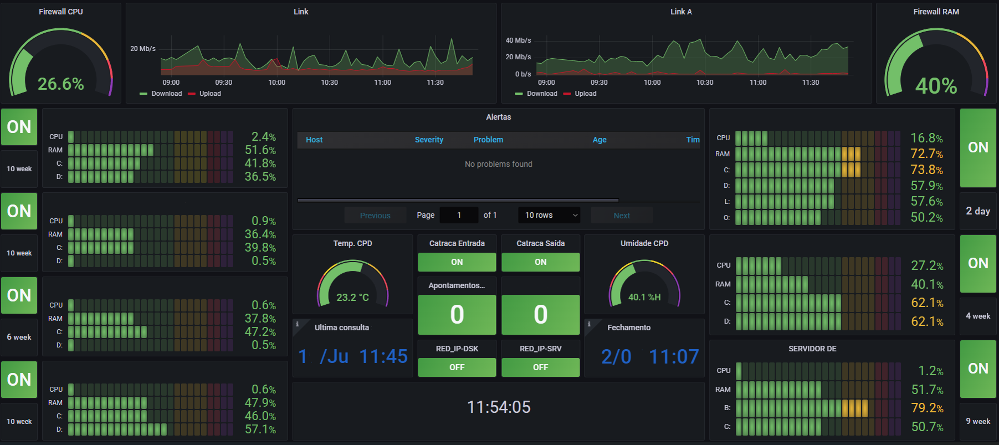

# Projeto de Monitoramento

projeto desenvolvido para aumentar a visibilidade e gestão de máquinas/processos críticos para o negócio e reduzir o perfil reativo do departamento, além de diminuir drasticamente o tempo de resposta quando necessário.

---

OBS: algumas informações nas imagens aqui contidas foram considerados dados sensíveis para empresa/negócio e foram censuradas.

# Requisitos

- Identificar computadores, servidores, serviços e processos críticos para o negócio;
- Determinar grupos de trabalho para facilitar a gestão e criar os **templates** no Zabbix;
- Identificar dentro de cada grupo quais **itens** eram importantes monitorar e separar por sub-grupos/**tags** para facilitar a busca e gestão;
- Determinar os valores padrões aceitáveis e as margens para cada valor, definindo cores para cada range.
    - Verde: de 0 a 59% de uso ou indicação de processo OK;
    - Amarelo: de 60 a 79% de uso ou indicação de Atenção;
    - Vermelho: de 80 a 89% de uso ou indicação de Incidente;
    - Roxo: de 90 a 100% de uso.
- Criar **Triggers** para os **Itens** de modo que a equipe recebesse em tela de monitoramento um alarme e pudesse agir antes do incidente acontecer, ou no mínimo antes do operador/usuário relatasse a falha;
- Instalar o Grafana e fazer integração do banco de dados do Zabbix;
- Criar 1 dashboard para cada uma das 2 áreas principais com os itens pertinentes para cada área.

# Resultados

## Dashboard Infraestrutura

## Dashboard Desenvolvimento/Sistemas

